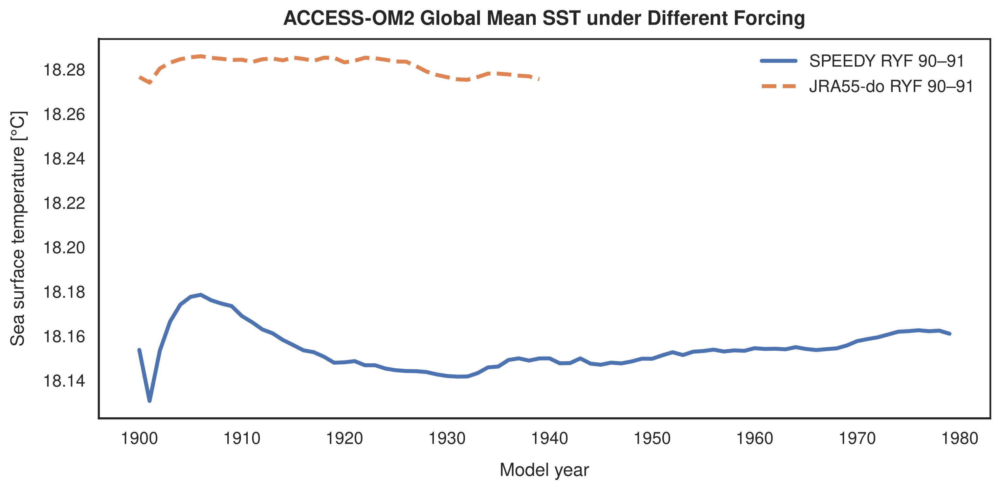
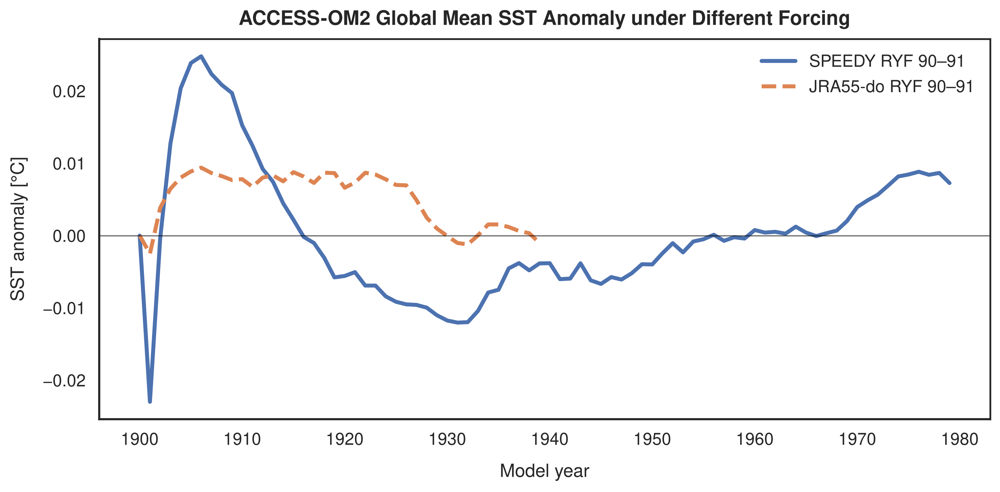
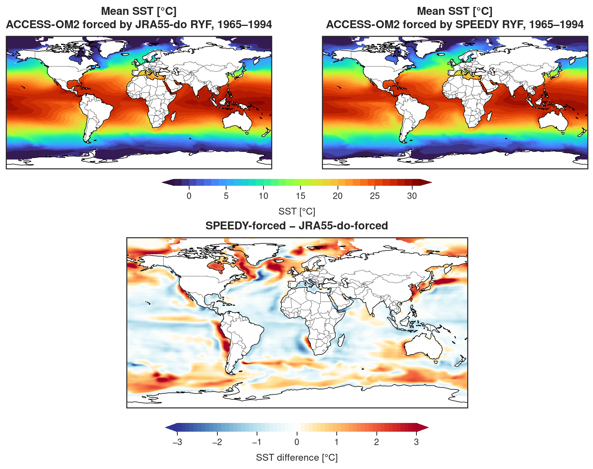
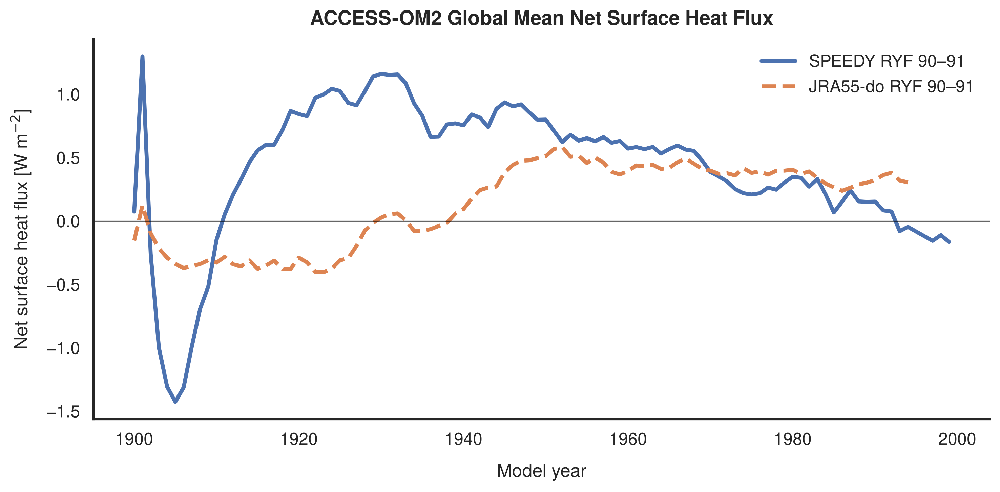
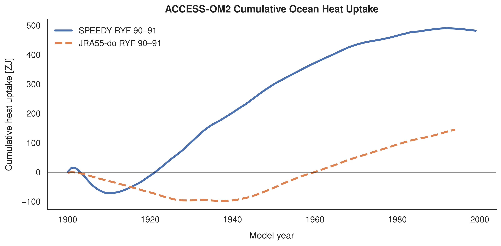
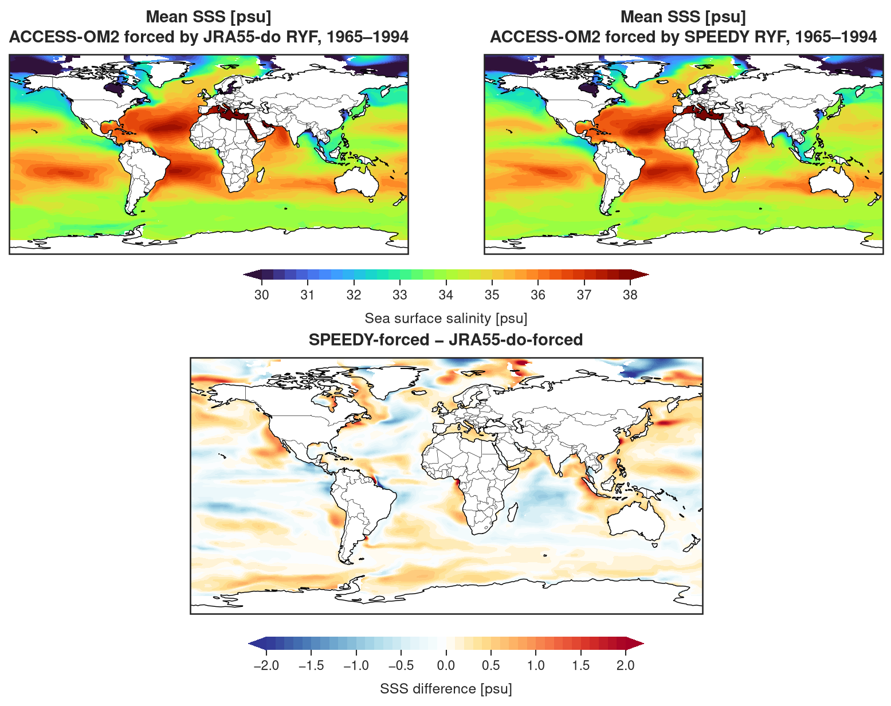

Analysis of ACCESS-OM2 experiments forced with SPEEDY T30 and JRA55-do atmospheric forcing.

## Experiments

Two 100-year ACCESS-OM2 1° experiments Repeat Year Forcing:

- **SPEEDY forcing** — atmospheric forcing generated from SPEEDY T30
- **JRA55-do forcing** — reference ACCESS-OM2 experiment

Both experiments start from the same ocean/sea-ice initial state and use Repeat Year Forcing (RYF).

- model spin-up and long-term drift --- done
- numerical stability
- sea-surface temperature --- done
- surface heat fluxes --- done
- kinetic energy
- meridional heat transport
- ocean circulation and overturning

