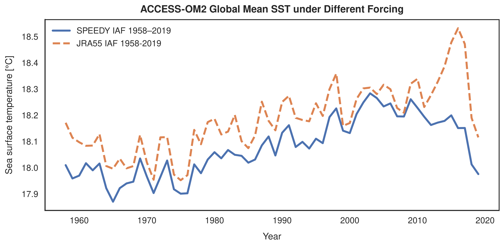
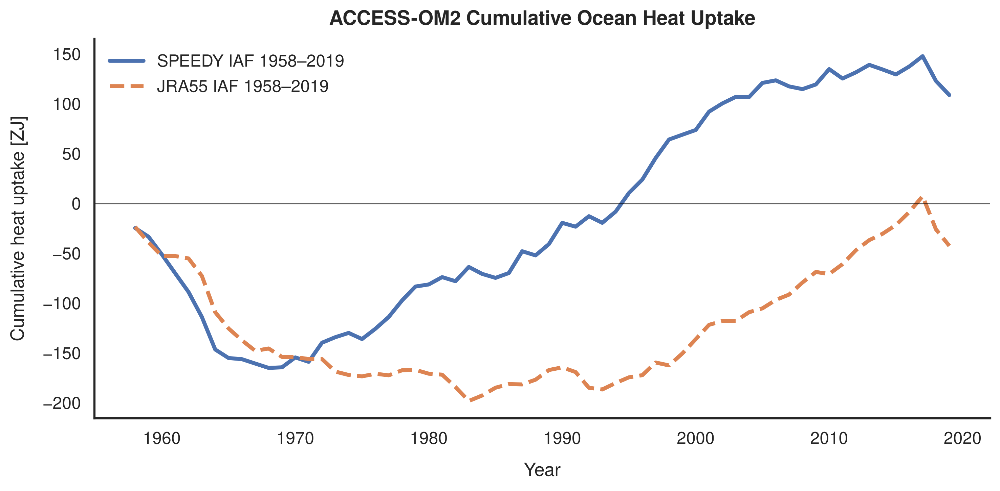
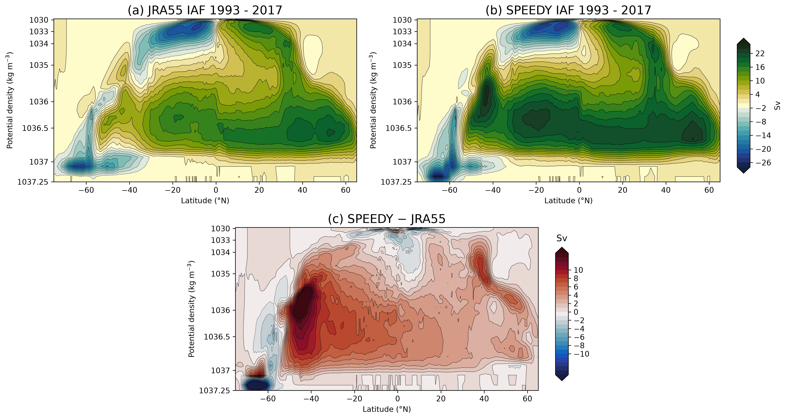
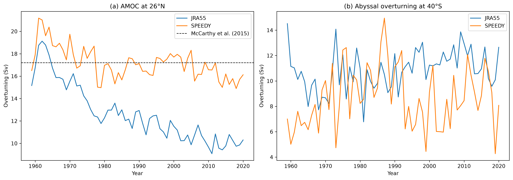

Two 1958–2019 ACCESS-OM2 1° experiments:

- **SPEEDY forcing** — atmospheric forcing generated from SPEEDY T30
- **JRA55-do forcing** — reference ACCESS-OM2 experiment

### Global mean SST

Reference: Kiss et al. (2020), Fig. 3.

### Ocean heat uptake

### Global overturning circulation

Reference: Kiss et al. (2020), Fig. 7.

### AMOC and abyssal overturning

Reference: Kiss et al. (2020), Fig. 8.

### GMOC evolution

<table>
<tr>
<td align="center">
 
<b>1958–1968</b>
</td>
<td align="center">
 
<b>1968–1978</b>
</td>
<td align="center">
 
<b>1978–1988</b>
</td>
</tr>

<tr>
<td align="center">
 
<b>1988–1998</b>
</td>
<td align="center">
 
<b>1998–2008</b>
</td>
<td align="center">
 
<b>2008–2018</b>
</td>
</tr>
</table>
